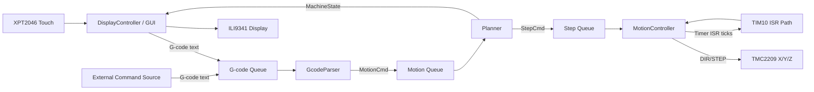

# CNC PCB Firmware

Embedded firmware for an STM32F405-based CNC PCB machine.

The project combines a **G-code parser**, **motion planner**, **step pulse controller**, and a **touchscreen GUI** (ILI9341 + XPT2046) running on **FreeRTOS**.

---

## Highlights

- STM32F405 + HAL + FreeRTOS architecture
- Queue-based pipeline: G-code text -> parsed motion -> planned steps -> motor pulses
- Custom UART-controlled TMC2209 stepper drivers (X/Y/Z), implemented from scratch
- Touch UI with main/control/error views
- CMake-based build with CubeMX-generated base
- No high-level ready-made CNC/motion libraries; parser, planner, control logic, and device drivers are project-owned

---

## Design Philosophy & Technical Achievements

- **End-to-End Ownership:** Complete implementation of the firmware stack from the G-code parsing and motion planning down to real-time execution, custom hardware drivers, and the graphical user interface.
- **Custom Driver Development:** Bare-metal protocol handling, precise timing, and ISR/RTOS task integration for TMC2209 (UART), ILI9341, and XPT2046 (SPI), intentionally built from scratch without relying on high-level third-party device libraries.
- **Hardware Abstraction & Portability:** The core business logic (parser, planner, error handling) is strictly decoupled from the hardware layer (`Core/Inc/hardware`). This clean architecture ensures the system can be easily ported to other microcontrollers and frameworks, such as Espressif's ESP32 (ESP-IDF), or compiled for host-based unit testing.
- **Robust RTOS Architecture:** Practical application of FreeRTOS featuring queue-based inter-task communication, deterministic control loops, and hardware interrupt callbacks to maintain real-time constraints.
- **Production-Ready Structure:** Adherence to professional software engineering practices, including modular C++ interfaces, a unified `Result<T>` error model, and a reproducible, modern CMake build system.

---

## Architecture

Runtime flow:

1. `GcodeParser` receives text commands (e.g. `G0/G1/G28`)
2. `Planner` converts `MotionCmd` to `StepCmd`
3. `MotionController` executes DDA stepping and acceleration ramps
4. Custom axis drivers (`TMC2209`) generate direction + step signaling
5. `DisplayController` updates UI and sends jog/start commands back to parser queue

Main C++ bootstrap is in `Core/Src/cpp_main.cpp`.

---

## How It Works (Runtime)

At startup, `cpp_main()` initializes shared queues, starts the GUI task, initializes motion hardware, and then starts planner and parser tasks.

Typical command lifecycle:

1. A command string is pushed to the parser input queue (from GUI action or external source).
2. `GcodeParser` validates syntax and converts the line into `MotionCmd`.
3. `Planner` transforms `MotionCmd` into `StepCmd` using machine config (steps/mm, limits, ramps).
4. `MotionController` consumes `StepCmd` and executes it in timer-driven ticks (DDA + accel/decel profile).
5. Axis drivers (`TMC2209`) apply direction and generate step pulses.
6. GUI reads planner state periodically and updates coordinates/status on screen.

Concurrency model:

- **Tasks** separate parsing, planning, and UI responsibilities.
- **Queues** provide deterministic communication between modules.
- **Timer ISR path** is responsible for precise step timing.
- **Error handling** is unified with `ErrorCode` and `Result<T>` across layers.

### Runtime Diagram



---

## Project Layout

- `Core/Inc/common` - shared types, config, error handling, task wrapper
- `Core/Inc/Gcode` - G-code parser interfaces
- `Core/Inc/planner` - planning and step command generation
- `Core/Inc/hardware` - ILI9341, XPT2046, TMC2209, motion controller
- `Core/Inc/display` - GUI views, widgets, display controller
- `Core/Src` - implementations
- `cmake/stm32cubemx` - CubeMX-generated CMake integration

---

## Build

Requirements:

- CMake 3.22+
- ARM GCC toolchain (`arm-none-eabi`)
- Ninja (recommended)

From project root:

```bash
cmake --preset Debug
cmake --build --preset Debug
```

Output artifact is generated in `build/Debug`.

---

## Hardware Targets

- MCU: STM32F405xx
- Display: ILI9341 (SPI)
- Touch: XPT2046 (SPI)
- Motor drivers: TMC2209 (UART)
- Timer-based step generation (interrupt-driven)

Pin assignments and low-level init are defined in CubeMX-generated sources (`main.c`, HAL MSP, and board config files).

---

## Notes

- C++ modules are compiled with embedded-focused flags (`-fno-rtti`, `-fno-exceptions`)
- GUI and motion are decoupled with FreeRTOS queues
- Error propagation uses a shared `ErrorCode`/`Result<T>` model
- Hardware communication paths (SPI/UART/GPIO stepping) are implemented in project drivers, not via third-party device libraries

---

## License

Project-specific license is not yet defined in this repository.
Third-party components (STM32 HAL, CMSIS, FreeRTOS) keep their original licenses.
